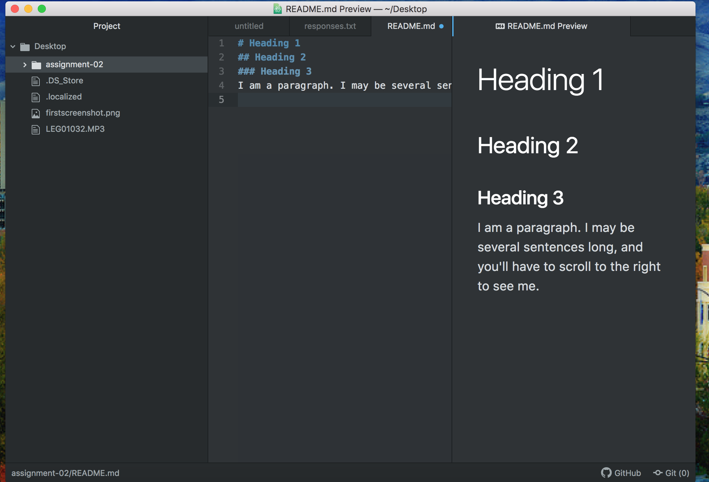

# Assignment 2
## Gabi Harrington

11. I decided to take this class because I felt it was important to learn how to code. I also joined because I thought it would be cool to learn how to make my own websites. I would like to make podcasts some day and I will need to know how to make my website!

12. 1. I have learned how to screenshot on my laptop. 2. I have learned how to make a header. 3. I have learned how to set up things on the internet in a more organized fashion.

[UM Sports Website](https://gogriz.com/)

[My Responses](./responses.txt)

