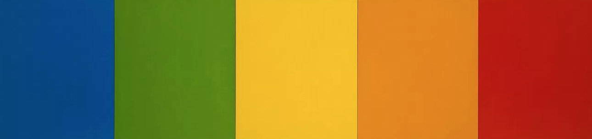

# Assignment 11
## Gabi Harrington

13. Padding is the area around the content. Margin is outside the border. Border is what's around the content and padding.

14. 

15. I recreated a piece from Ellsworth Kelly using padding, margins, divs, borders, a z-index, position, and display. It was hard to use the CSS again, but I think I am getting the hang of it!
